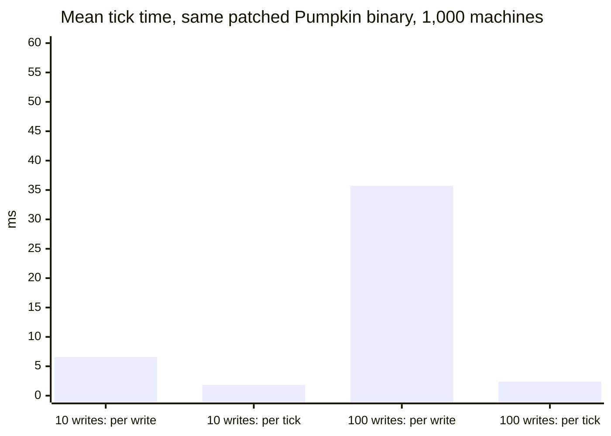

# What a world write costs a Pumpkin plugin

Results from 5 October 2026. Pumpkin `2c7931a` (master), NeoForge 26.3.0.51-beta, Minecraft 26.3, DGX Spark (GB10).

A ticking-machine workload measured on Pumpkin and on NeoForge, a breakdown of where Pumpkin's tick time goes, and a prototype batched write that removes most of it.

## Findings

- Each world write from a WASM plugin costs about **0.33 ms** of tick time. One hundred writes per tick take a tick from 1.2 ms to 34 ms, and its p99 past the 50 ms budget.
- The cost follows the number of host calls, not the amount of plugin work. Growing the grid from 1 to 10,000 machines changes nothing; adding writes adds a fixed amount per write.
- A batched `set-block-states` call ([31-line prototype](../pumpkin/patches/bulk-write.py)) brings 100 writes per tick from **30.6 ms to 2.2 ms**, about 6 µs per write. Each write is the same `World::set_block_state` call as before.
- About 1.2 ms per tick remains for calling the plugin at all. With bulk writes Pumpkin is within 1.5× of NeoForge running real block entities, using 183 MB of memory against 3.7 GB.



"Per write" is one host call per write (`wasm-batched`); "per tick" is one host call per tick (`bulk`). With no writes at all the tick takes 1.2 ms. The tick budget at 20 TPS is 50 ms.

## Setup

Every variant runs the same workload, `energy-grid` ([SPEC.md](../SPEC.md)): a square grid of *n* machines that tick every server tick, pass energy to their four neighbours (integer maths, double-buffered so order does not matter), and rewrite a display block above a fixed share of the machines, alternating white and lime wool so every write changes the world. Writes use full updates (neighbours and listeners) on both servers.

A run counts only if the server reproduces the reference checksum: the energy of every machine after the run, weighted by its index, must match the [reference implementation](../workload/src/lib.rs) bit for bit. All 18 runs below did, so no variant can look fast by doing less work.

- **Tick time.** Pumpkin: `duration_nanos` from its own `ServerTickEndEvent`, which starts before `ServerTickStartEvent` handlers (where the plugin does its work) and ends after the world tick. NeoForge: first `ServerTickEvent.Pre` listener to last `ServerTickEvent.Post` listener. Only measured ticks are recorded (`/probe arm`).
- **CPU per tick** is the whole process's user and system time from `/proc`, so work on other threads counts.
- **Hardware.** DGX Spark (GB10). The server is pinned to the ten Cortex-X925 cores, nothing else runs on them, and every run starts from a freshly generated world with the grid's chunks force-loaded. No client is connected.
- **Software.** Pumpkin built with its own release profile (fat LTO), Rust 1.99. NeoForge on Java 25.0.4.1 with a 6 GB heap.

## NeoForge and Pumpkin at 10,000 machines

10,000 machines, 100 writes per tick, 2,400 measured ticks after 1,200 warm-up ticks.

| Variant | Server | Mean | Median | p99 | CPU / tick | Memory |
|---|---|---:|---:|---:|---:|---:|
| Block entity per machine | NeoForge | 1.48 ms | 1.42 ms | 2.84 ms | 2.46 ms | 3,700 MB |
| One loop over all machines | NeoForge | 0.63 ms | 0.60 ms | 1.02 ms | 1.51 ms | 3,302 MB |
| WASM plugin, one host call per write | Pumpkin, unmodified | 36.03 ms | 36.74 ms | **55.82 ms** | 12.34 ms | 183 MB |
| WASM plugin, one host call per write | Pumpkin, bulk-write patch | 30.59 ms | 33.26 ms | **54.48 ms** | 10.77 ms | 183 MB |
| WASM plugin, one host call per tick | Pumpkin, bulk-write patch | 2.21 ms | 2.08 ms | 3.66 ms | 1.17 ms | 184 MB |

Bold: over the 50 ms budget. NeoForge's CPU time exceeds its tick time because the JIT compiler and garbage collector run on other threads.

## Where Pumpkin's tick time goes

One variable at a time, unmodified Pumpkin, 600 measured ticks after 200 warm-up ticks (the last row is the full-length run above).

| Machines | Writes per tick | Mean | p99 | CPU / tick | CPU ÷ tick time |
|---:|---:|---:|---:|---:|---:|
| 1 | 0 | 1.76 ms | 2.67 ms | 0.77 ms | 0.44 |
| 1,000 | 0 | 1.21 ms | 2.57 ms | 0.67 ms | 0.55 |
| 10,000 | 0 | 1.16 ms | 2.08 ms | 0.70 ms | 0.60 |
| 1,000 | 10 | 5.56 ms | 9.60 ms | 1.98 ms | 0.36 |
| 1,000 | 50 | 14.70 ms | 31.41 ms | 5.30 ms | 0.36 |
| 1,000 | 100 | 34.02 ms | 48.75 ms | 11.77 ms | 0.35 |
| 10,000 | 100 | 36.03 ms | **55.82 ms** | 12.34 ms | 0.34 |

Plugin compute is negligible: the grid step for 10,000 machines costs nothing measurable over 1 machine. The fixed floor of about 1.2 ms is the tick event reaching the plugin plus one `get-world-by-name` call. Each write then adds about 0.33 ms ((34.02 − 1.21) ÷ 100), and the process is busy for only about a third of that time: the tick thread is mostly waiting.

That matches how host calls are made. A world-touching import goes through `pump_blocking` in `crates/pumpkin-plugin-runtime/src/executor.rs`, which hands the operation to the blocking thread pool and waits for it while keeping the plugin's store free to serve re-entrant callbacks:

```rust
let (result, receiver) = oneshot::channel();
self.shared.spawner.spawn_blocking(Box::new(move || {
    let output = catch_unwind(AssertUnwindSafe(|| sync_scope(context, operation)))
        .map_err(|payload| panic_message(payload.as_ref()));
    let _ = result.send(output);
}))?;
self.pump_reentry_with_context(store, context, receiver).await?
```

So every write is one cross-thread round trip, and a sleeping worker has to wake up for each one. The design is deliberate (see [design fit](#design-fit-and-what-an-upstream-version-needs)); the cost is paid per call.

## The batched-write prototype

One new method on `world`: `set-block-states(changes: list<tuple<block-pos, u16>>, update-flags)`. The host validates the states, then applies every write inside a single `pump_blocking` job, calling the same `World::set_block_state` a single write uses. The [`bulk`](../pumpkin/bulk/src/lib.rs) plugin is the one-call-per-write plugin with one change: it collects the tick's writes, releases its own lock, and sends them in one call.

| Same patched binary, 1,000 machines | One call per write | One call per tick | Speed-up |
|---|---:|---:|---:|
| 10 writes per tick, mean | 6.55 ms | 1.84 ms | 3.6× |
| 100 writes per tick, mean | 35.71 ms | 2.37 ms | 15.1× |
| 100 writes per tick, p99 | **54.48 ms** | 3.86 ms | 14.1× |
| 100 writes per tick, CPU / tick | 12.60 ms | 1.17 ms | 10.8× |

Going from 10 to 100 batched writes adds 0.53 ms, about 6 µs per write: the real cost of setting a block and updating its neighbours. The rest of the 0.33 ms per write was the round trip.

The patch is [`pumpkin/patches/bulk-write.py`](../pumpkin/patches/bulk-write.py) (3 files, 31 lines on `2c7931a`).

## Design fit, and what an upstream version needs

What it keeps:

- **Re-entry.** All writes run inside one `pump_blocking` job, so events a write fires can still call back into the plugin.
- **The event contract.** Each write is the same `World::set_block_state` call, so events fire where and as they do today.
- **Permissions.** Block writes are not permission-gated, so batching routes around nothing.
- **The WIT guidance on boundary traffic.** It removes crossings, the same goal behind chainable methods in `pumpkin-plugin-wit/AGENTS.md`.

What the prototype does not do:

- It adds to the published v0.1 WIT. Upstream it belongs in v0.2, as an `async func` like `set-block-state` in [#3713](https://github.com/Pumpkin-MC/Pumpkin/pull/3713).
- It changes only the WIT and the v0.1 host, and skips `pumpkin-codegen -- wit`.
- No size cap: a huge list is allocated host-side, outside the plugin's memory limit.
- Semantics need writing down: writes apply in order, a batch is not atomic, and the plugin cannot observe the world between writes in one batch.

A cheaper round trip would help every host call, not only writes: a dedicated worker instead of the general blocking pool, or running calls that cannot fire events inline. Batching and a cheaper round trip are complementary.

### Making the fast path the easy one

Batching a mod's own logic (one network or controller ticking many blocks, as Mekanism and AE2 do) is the mod's job on any platform, and on Pumpkin it comes naturally because plugin state already lives in the plugin. Batching host calls is different: a mod cannot batch calls the API does not let it batch. Mods ported from Java will also bring Java's habit of calling into the world whenever convenient, which is free on NeoForge and costs about 0.33 ms per call here.

Three things would make the efficient path the default:

- **Bulk host calls** in v0.2 (writes here, reads in [#3719](https://github.com/Pumpkin-MC/Pumpkin/pull/3719)).
- **An opt-in write buffer in `pumpkin-plugin-api`** that collects writes during a handler and flushes them in one call when it returns. A ported mod gets batching without restructuring; the trade-off is that buffered writes are not visible to reads in the same handler until the flush, which is why it should be opt-in.
- **A note in the plugin docs** that world calls cross a thread boundary: cache handles such as the world, skip writes that change nothing, and batch the rest.

## Why NeoForge mods don't batch writes

A NeoForge mod is Java code loaded into the server's own JVM and called on the server thread. `level.setBlock` is an ordinary method call into the same memory, with no boundary, copy or thread hand-off, so there is no per-call overhead to amortise. The vanilla server already batches the parts that are expensive per change, such as lighting work and the block-change packets sent to clients.

The price is isolation: a Java mod is fully trusted and can crash or corrupt the server. A Pumpkin plugin runs in a sandbox with its own memory, can be stopped if it traps, and can be written in any language that targets WASM, so every call across the boundary has a fixed cost. Batching is how sandboxed APIs usually pay that cost once instead of per item; #3719's bulk section reads make the same argument for reads.

The NeoForge variants also show that batching the mod's own logic matters on any server: the same work in one loop instead of 10,000 block entities is 2.3× faster on NeoForge.

## Limitations

- One run per configuration. Repeated Pumpkin configurations differed by 10–20% between runs, far less than the effects reported here.
- One workload, writes only. Other host calls (reads, entity work) were not measured, though they go through the same mechanism.
- The plugin looks the overworld up by name every tick. Caching it would remove one round trip from the 1.2 ms floor.
- The `wasm-batched` plugin was written by a local model (Qwen3.8-Flash-Next) under an automated gate that requires a build, clippy with `-D warnings` and a matching checksum on a live server, and was then reviewed. `bulk` and the patch were written with Claude.

Raw results, one JSON per run, are in [`results/raw/`](../results/raw/).
