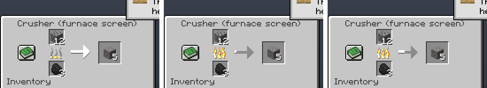
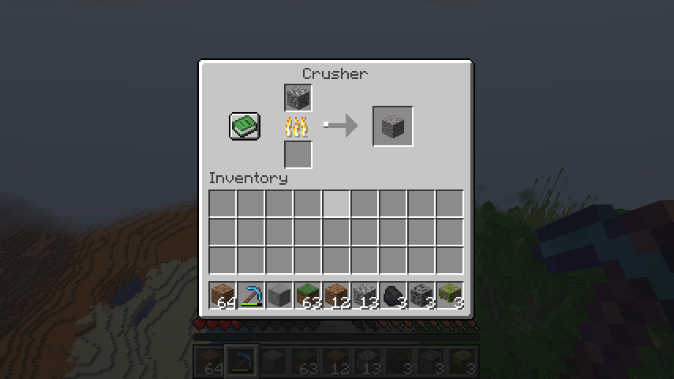

# Machines (block entities and menus): feasibility on Pumpkin's plugin API

Checked 2026-10-06 against Pumpkin `2c7931a` (`master`), plugin API v0.1. The question: without
new block IDs (that needs runtime registries, PR #3887, postponed past 1.0), can a plugin turn a
vanilla block into a working machine with an inventory, a ticking process, a furnace-style menu
with a progress arrow, and state that survives a restart? Everything comes from Pumpkin's own WIT
and host code (read only) and from runs of the scratch plugin `pumpkin/feas-machine`.

## Summary

| Need | Today (v0.1) | How |
|---|---|---|
| Find a block entity and its inventory | yes | `world.get-block-entity(pos)` gives a typed variant (barrel, furnace, hopper, chest, ...) with `get-container()` |
| Read and write slots | yes | `container.get-stack` / `set-stack` |
| Work with vanilla automation | yes | a vanilla hopper fed the machine barrel |
| Tick a machine | yes | `scheduler::schedule-repeating-task`, the world touched only when an operation completes |
| Store machine state on the block | yes | block-entity `set-custom-data(ns, key, nbt)`, survives a restart |
| Store state per chunk | yes | `chunk.set-custom-data`, survives a restart |
| Find machines again after a restart | workaround | `ChunkLoadEvent` is never fired, so the plugin keeps an index file in its data folder |
| Machine item that places a machine | yes | item custom name plus `set-custom-data`; `block-place-event` plus `get-item-in-hand` see both |
| Right-click opens the machine's menu | yes | cancel `player-interact-event` (`right-click-block`), then `player.open-gui` |
| Furnace-style menu with progress arrow | yes, roundabout | `Gui::new(Screen::Furnace, ...)`, then raw `c-set-container-property` packets |
| Know the menu's window ID | workaround | not exposed; the plugin mirrors Pumpkin's per-player counter |
| Close a menu | workaround | no call; raw `c-close-container` packet (the server isn't told) |
| Block taking items out of, or putting items into, a menu | yes | `gui.set-allow-grab-items(false)` / `set-allow-put-items(false)` |
| Clicks on the player's half of a plugin menu | no | Pumpkin rejects them as invalid slots, see below |

So a "machine on a vanilla block" layer can be built on v0.1 today. Its real limits are the
menus (no window ID, no close, player half broken) and restoring machines on chunk load.

## Results

Headless, from the server console (`scripts/feas_machine_headless.py`, forceload-patched build,
two server sessions): **21 passed, 0 failed.** An isolated chunk unload/reload check
(`scripts/feas_chunk_unload.py`): **5 passed.**

Covered:

- barrel (27 slots), furnace (3) and hopper (5) are all reachable as containers;
- the plugin writes a stack into a barrel slot, and a vanilla hopper pushes into the barrel;
- plugin data on a block entity, on a chunk and in a data-folder file, read back in the same
  session and again after a restart;
- a crusher on a barrel turns 5 cobblestone into 5 gravel over 100 ticks;
- after a restart the machine is restored from the index, keeps working (7 gravel) and its counter
  continues from block-entity data (5 + 2 = 7).

With a real client (26.3 vanilla, driven by background input, play-test server): **all pass.**

| Check | Result |
|---|---|
| Plugin opens a chest menu, filled from the plugin | opens with the plugin's items |
| Take an item out of it | refused, the item stays and the cursor stays empty |
| Window ID in the click packet vs the plugin's mirror | 1 = 1, and 3 = 3 after three menus |
| Furnace menu with animated progress | arrow fills and the flame burns down, from `c-set-container-property` alone |
| Right-click a registered machine barrel | the plugin's "Crusher" menu opens, not the barrel's inventory |
| Place a machine item (barrel named "Crusher" with `mfeas:machine` data) | the place event sees the name and the data; the barrel registers as a machine |
| Feed the placed machine | 3 cobblestone become 3 gravel |

The first frame is the instant the menu opened, before the first property packet. The other two
are 1.5 s apart.

## How the menu works

- `Gui::new(Screen::Furnace, title)`, `set-item` per slot, grab and put switched off,
  `player.open-gui(gui)`.
- Progress is sent as furnace container properties: 0 fuel left, 1 fuel total, 2 cook progress,
  3 cook total. They go through `player.as-java().send-packet(c-set-container-property)`. The
  packet needs the window ID.
- Pumpkin keeps a per-player counter (`id % 100 + 1`, starting at 0). Vanilla screens bump it after
  `inventory-open-event`; `open-gui` bumps it without firing the event. The plugin mirrors it by
  bumping on its own opens and on uncancelled `inventory-open-event`s. Click packets
  (`packet-received-event`, id 18) start with the window ID, which confirmed the mirror.
- `packet-sent-event` only fires for older protocol versions, so it can't be used to learn the ID
  from the outgoing open-screen packet on a 26.3 client.
- Player handles are not `Clone`, so a repeating task looks the player up by name every step.

## Upstream gaps found

1. **`ChunkLoadEvent` is defined but never fired.** No code in core constructs it, and no issue is
   open (the events tracking issue #1609 is closed). Machines can't be restored lazily per chunk.
   Workaround: an index file in the plugin's data folder (needs `fs.read.data`/`fs.write.data`).
2. **No window ID for `open-gui`.** `open-gui` should return the sync ID, or the GUI resource
   should offer `set-property(index, value)`. Mirroring Pumpkin's counter works, but it breaks as
   soon as another plugin calls `open-gui`, because that bumps the counter without an event.
3. **No way to close a menu.** The plugin can send `c-close-container`, but the server's screen
   state isn't updated. Wanted: `player.close-screen()`.
4. **Clicks on the player's half of a plugin menu are rejected.** The plugin GUI's screen handler
   only holds the menu's own slots. A click on slot 27+ (the player's inventory under a 9x3 menu)
   logs `clicked invalid slot index: 27, available slots: 27` and is dropped before
   `inventory-click-event`. The client then shows a stack on its cursor that the server doesn't
   have. After a reconnect the player half of a plugin menu drew empty rows, though the server
   still had every item (checked in the saved player file). Server data was not affected.
5. **`plugin unload` doesn't unregister the plugin's permissions**, so `plugin load` of the same
   plugin fails with `Permission mfeas:command is already registered`. The half-loaded plugin's
   packet handler then logs `Wasm plugin store is shutting down` about 20 times a second until
   restart. `plugin load` also takes only a single word, so a path under `plugins/` can't be given.
6. **Forced chunks are not reloaded after a restart** (until `forceload add` again), on top of
   `/forceload` never loading chunks for playerless servers (#2592, fix #3845 open).
7. Smaller: `/setblock` can't parse block-state properties yet (PR #3827 open); a
   `StringType::SingleWord` command argument rejects `:`, so item IDs need `Greedy`.

## Notes for building it

- Touch the world only when an operation finishes, not every tick. Each host call is about
  0.33 ms (see RESULTS.md), so a machine that reads its inventory every tick costs about 7 ms per
  second per machine.
- Read state from block-entity data lazily on the first tick after load, rather than in a load
  event that never comes.
- A machine item is an ordinary vanilla block item with a custom name and plugin custom data. It
  shows up in the place event's held item, so no new item IDs are needed.
- Not checked: whether the hand stack is decremented correctly when a plugin-given stack is
  placed in survival (the client still showed 4 barrels after one was placed).

## Testing without taking the PC

Minecraft 26.x draws through SDL3, not GLFW, and drops posted key presses while unfocused, so
commands came from the server console (`mfeas guifor <player> <kind>`, `givefor`, `closefor`).
Posted mouse clicks work if the move, press and release are posted together. SDL3 answers a mouse
move with a leave-tracking request, and the leave message resets the cursor to the real one, so
anything posted later lands outside the window (slot -999). Screenshots use `PrintWindow` with
full-content rendering, which works while the game is covered.
