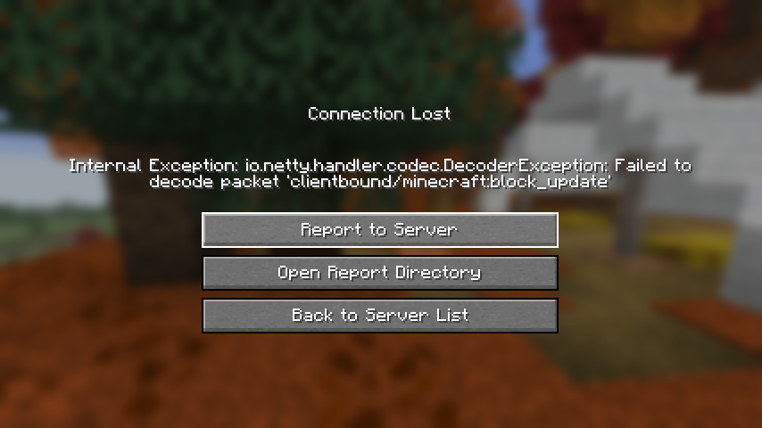
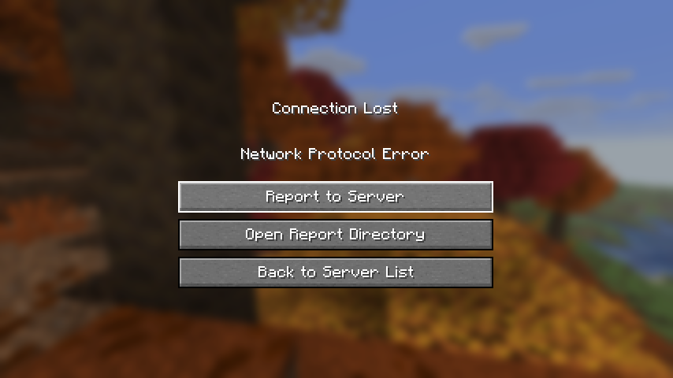

# Runtime registries (Pumpkin PR #3887): test results

Tested 2026-10-06 on Eric's branch `feat/runtime-registries` at `6efbe86` ("fixes, comment
cleanup"), the commit that answers Megalith's review. Built on an ARM64 Linux box (DGX Spark). For
the runtime checks the build also had our forceload patch, because stock Pumpkin loads no chunks
without a player (Pumpkin-MC/Pumpkin#2592). The patch only touches chunk tickets
(`world/active_chunks.rs`, `world/mod.rs`), not the PR's code.

PR: https://github.com/Pumpkin-MC/Pumpkin/pull/3887

## Summary

| What | Result | Evidence |
|---|---|---|
| Registry calls from a v0.2 plugin (headless, 3 server sessions) | 18 passed, 0 failed | [rr_headless.txt](../results/rr-3887/rr_headless.txt), server logs below |
| Machine-layer suite (v0.1 plugin) on the PR build | 21 passed, 0 failed | my own machine-layer test plugin (not published yet) |
| Chain-mining smoke (v0.1 plugin) on the PR build | 23 passed, `SMOKE PASSED` | `qwen/chainmine_smoke.py` |
| `cargo test --workspace` | 1 failure: `loads_nested_tag_files` | same failure as the PR's CI |
| Chunk read before registration closes | **not exercised**, see below | `server-two.log` line 15 |
| Vanilla 26.3 client | joins, then is disconnected when a custom block reaches it | [vanilla-client.log](../results/rr-3887/vanilla-client.log), screenshots |

## Registry checks

Plugin: [`pumpkin/rr-test`](../pumpkin/rr-test/src/lib.rs). It binds the v0.2 WIT directly, because
`pumpkin-plugin-api` only targets v0.1. It registers `rrtest:crusher` (`facing` x `lit`, 8 states,
in `minecraft:mineable/pickaxe`), `rrtest:stairs` (oak_stairs' four properties, 80 states, added to
`minecraft:climbable`) and the item `rrtest:crusher`, linked to the block. Every result is a log
line starting with `rrtlog`. Script: [`scripts/rr_headless.py`](../scripts/rr_headless.py).

| Check | Result | Log line |
|---|---|---|
| Register a block | id 1286 (first after the 1286 vanilla blocks), states from 35723 | `register crusher -> Ok(1286)` |
| Same definition again | same id | `register crusher again -> Ok(1286)` |
| Changed definition, same key | refused | `Err("block 'rrtest:crusher' is already registered with another definition")` |
| Register an item, link it to the block | id 1658; the block listing shows the link (`item=Some(1658)`). **Effect not checked:** the item was never given, placed or dropped | `register item -> Ok(1658)`, `link -> Ok(())`, `block rrtest:crusher ... item=Some(1658)` |
| Add a custom block to a vanilla tag | call accepted. **Effect not checked:** nothing tested that the stairs count as climbable | `block tag -> Ok(())` |
| State numbering against vanilla | all 80 oak_stairs states match, same default state (offset 11) | `stairs combos=80 mismatches=0 ... default_offset ours=Some(11) oak=Some(11)` |
| Vanilla `/setblock` with a custom key | works, read back as `rrtest:crusher` (the plugin fallback was not used) | `Changed the block at 4, 100, 4` |
| Custom block read back, default and non-default state | `rrtest:crusher` at 4 100 4 (state 35724 = base + 1, `facing=north lit=false`) and 6 100 4 (35729 = base + 6, `facing=east lit=true`), both the ids the numbering rule gives | `get 4 100 4 id=35724 block=1286 name=rrtest:crusher` |
| Second custom block in another chunk | `rrtest:stairs` at 36 100 4 (35772 = 35731 + 41, `facing=west half=top`, rest default) | `get 36 100 4 id=35772 block=1287 name=rrtest:stairs` |
| Register after startup | refused for blocks and items | `Err("blocks can only be registered before players connect")` |
| Custom blocks after one and two restarts | all three still there, same state ids | session two and three in `rr_headless.txt` |

The numbering check compares, for each of the 80 property combinations, the state's offset from
the block's first state as returned by `get-state-id`, for `rrtest:stairs` and for
`minecraft:oak_stairs`. That is the check Megalith asked for in the review. The script itself only matched block names
when reading blocks back; the state ids in the table were checked by hand against the numbering
rule (properties sorted by name, first one most significant, values in declared order).

## The chunk-read-before-registration case: not exercised

The review's point: worlds load before plugins register blocks, so a chunk read in that window
turns custom blocks into air and saves the air back. `6efbe86` handles it by flagging such a chunk
(`holds_unregistered_blocks`) and never reporting it as dirty while the flag is set
([`chunk/format/mod.rs` L70-L73](https://github.com/EricApostal/Pumpkin/blob/6efbe86575592391b8cb631f96b93ac44d887b0a/crates/pumpkin-world/src/chunk/format/mod.rs#L70-L73),
[L443-L450](https://github.com/EricApostal/Pumpkin/blob/6efbe86575592391b8cb631f96b93ac44d887b0a/crates/pumpkin-world/src/chunk/format/mod.rs#L443-L450)).

The test tried to create that situation: on the second start the plugin read 4 100 4 (a custom
block placed in session one) before registering anything. The read returned air without loading
the chunk (`server-two.log` line 15: `rrtlog preread 4 100 4 id=0 block=0 name=air`), and the
server never printed its warning "names blocks that are not registered yet" (0 hits in all three
logs). So the chunk stayed unloaded until after registration, and the checks for chunk (0, 0) in
sessions two and three are for an ordinary chunk. The script now says so in its output.

No other way to load a chunk that early was found on this build:

- in `on-load`, `world.get-chunk` only returns chunks that are already loaded
  ([`pumpkin-wasm-host-v0_2/src/world.rs` L613-L634](https://github.com/EricApostal/Pumpkin/blob/6efbe86575592391b8cb631f96b93ac44d887b0a/crates/pumpkin-wasm-host-v0_2/src/world.rs#L613-L634)),
  and `server.execute-command` needs a command sender, which a plugin doesn't have during load;
- players can't connect before registration closes;
- the server's own startup didn't trigger the warning in any of these runs either.

So the flagged path is covered only by the PR's unit test. **Code reading only, not observed:**
the flag is cleared only when the chunk is read from disk again, and while it is set `is_dirty()`
returns false. A flagged chunk that stays loaded would therefore drop every later edit at save
time, not just the air. CodeRabbit raised the same point on the PR.

## Vanilla client

A vanilla 26.3 client (Prism instance, driven in the background) on a copy of the play-test server
with the same plugin:

1. **Join with custom blocks registered, none in view:** works. The runtime tags (with ids the
   client doesn't know) don't stop it.
2. **Custom block placed next to the player:** disconnected immediately,
   `Failed to decode packet 'clientbound/minecraft:block_update'`.

   

3. **Rejoin with the custom blocks in the spawn chunk:** can't join.
   `Failed to handle packet ClientboundLevelChunkWithLightPacket[x=0, z=0, ...]`,
   `java.lang.IllegalArgumentException: No value with id 35724` (the crusher's state id), from
   `LinearPalette.read`.

   

This is expected without a client mod, but the API has no fallback: a block can't declare a
vanilla state to send to clients that don't have the mod (the approach the Fabric library Polymer
takes), so one custom block near spawn locks every vanilla client out.

## Megalith's review points, read against `6efbe86`

| Point | State |
|---|---|
| CI red, `pumpkin-data` tests don't compile | compiles; one test still fails: `loads_nested_tag_files` expects the key `c:ingots/ruby`, the test file gives `c:ingots/mymod` ([L106](https://github.com/EricApostal/Pumpkin/blob/6efbe86575592391b8cb631f96b93ac44d887b0a/crates/pumpkin-core/src/data/datapack/item_tag_loader.rs#L106)) |
| Global `RwLock` on every dynamic lookup | done: after the freeze reads go to a `OnceLock` copy without a lock |
| `has_tag` ignores runtime tags | done: `has_tag` also checks the runtime tags, lock free, no allocation on the usual path |
| Chunks read before registration | changed to "don't save a flagged chunk"; runtime case not exercised (above) |
| Property order against real vanilla data | passes at runtime against oak_stairs (above) |
| `new_or_air` in numeric palettes, stale safety comments | done (`from_raw_or_air`, comments updated) |
| Ids follow registration order, loader handshakes | documented ("ids follow registration order on this server"), no sync hook |
| Split the PR | not split: 67 files, +9,705 / -2,517 against `2c7931a` |

## Files

- [`results/rr-3887/rr_headless.txt`](../results/rr-3887/rr_headless.txt): script output
- [`results/rr-3887/server-one.log`](../results/rr-3887/server-one.log),
  [`server-two.log`](../results/rr-3887/server-two.log),
  [`server-three.log`](../results/rr-3887/server-three.log): server logs of the three sessions
- [`results/rr-3887/client-test-server.log`](../results/rr-3887/client-test-server.log): server log
  of the vanilla-client test (player name replaced)
- [`results/rr-3887/vanilla-client.log`](../results/rr-3887/vanilla-client.log): the relevant client
  log lines (server address and player name replaced)
- `docs/img/registries/`: the two client screenshots

To rerun: copy `crates/pumpkin-plugin-wit/v0.2` from the PR branch to `pumpkin/rr-test/wit`, build
the plugin with `cargo build --release --target wasm32-wasip2`, build the PR (plus the forceload
patch) and run `python3 scripts/rr_headless.py --bin <pumpkin binary>`.
